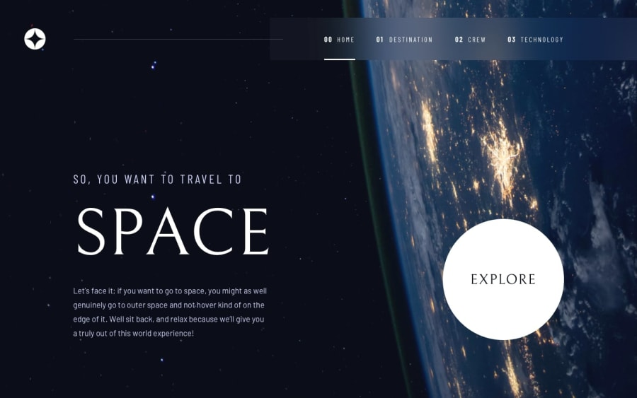
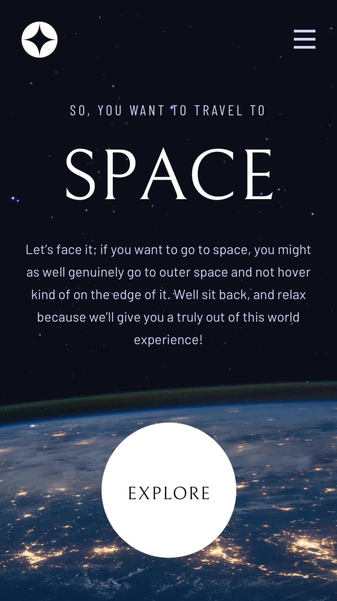

# 🚀 Space Tourism Website

This is a solution to the [Space tourism website challenge on Frontend Mentor](https://www.frontendmentor.io/challenges/space-tourism-multipage-website-gRWj1URZ3). This challenge helped me practice building a fully responsive multipage site using modern web technologies and design patterns.

---

## 📋 Table of Contents

- [Overview](#overview)  
  - [Screenshots](#screenshots)  
  - [Live Links](#live-links)  
  - [Built With](#built-with)  
- [Author](#author)

---

## Overview

Users should be able to:

- View optimal layouts for all pages on desktop, tablet, and mobile.
- Navigate through pages with tabbed content interactions.
- Experience smooth hover and animation states across the UI.

---

### Screenshots

#### 🖥️ Desktop

#### 📱 Mobile

---

### Live Links

- 📁 GitHub Repository: [Space Tourism Website](https://github.com/vedantagrawal524/space-tourism-website)  
- 🌐 Live Site: [https://space-tourism524.vercel.app/](https://space-tourism524.vercel.app/)

---

### Built With

- HTML5  
- Tailwind CSS  
- JavaScript 
- Flexbox & CSS Grid  
- Mobile-first workflow  
- [Vercel](https://vercel.com/) for deployment  

---

## Author

- Portfolio – _Vedant Agrawal_  
- Frontend Mentor – [@vedantagrawal524](https://www.frontendmentor.io/profile/vedantagrawal524)  
- GitHub – [@vedantagrawal524](https://github.com/vedantagrawal524)  

---

📌 _Built with creativity, code, and cosmic vibes. Contributions and suggestions are always welcome!_
